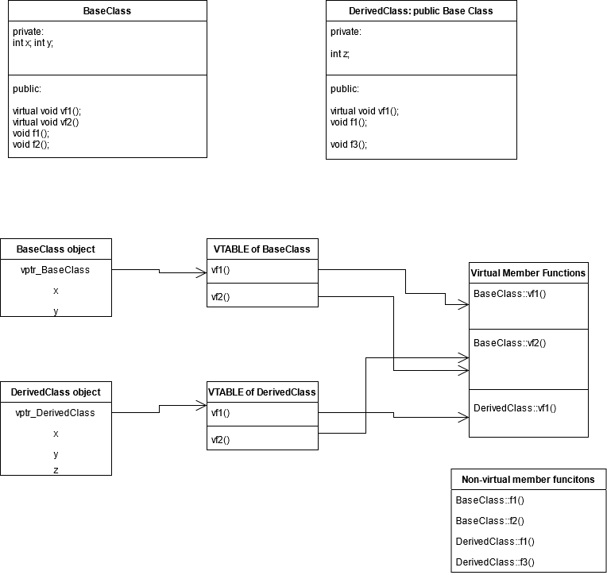

# Polymorphism 

One of four pillars of [[OOP | Object oriented programming]]. 

Dispatching - finding right method to call.  
Late binding, dynamic binding, dynamic dispatch - runtime plymorphism 
It happens when virtual keyword is used in method declaration, cpp creates virtual table which is look-up table for calling such methods 
	
Early binding - compile time polymorphism - method overloading 

### Binding and dispatching
Dispatching means finding right method to call. 

Late binding, dynamic binding, dynamic dispatch, runtime plymorphism - it happens when virtual keyword is used in method declaration, cpp creates virtual table which is look-up table for calling such methods. 
		
Early dispatch, early binding, static binding, compile-time polymorphism - it happens when we define two different functions with the same name but with different number/type of arguments. 

Static binding -> calling a ficed function address (in assembly)
Dynamic binding -> calling variable address by using VPTR: 
```C++
(*(p->vptr[n])(p))			// p is 'this' pointer
```

#### Requirements of runtime polymorphism 
* We hate to use a pointer
* Pointer must call a virtual function

```C++
B b; 
A a = (A)b; 
a.vf1(); 		/// WRONG! Static binding
```


```C++
A a = new B(); 
a.vf1(); 		// GOOD! Dynamic binding 
```

### Virtual member functions
* Virtual function is a function declared in a base class that can be overriden in a subclass. 
* Bjarne: The keyword virtual means "may be redefined later in a class derrived from this one"
* Marking function as virtual causes overhead since VTABLE and VPTR are created
* Creating virtual method causes late binding/late dispatch which is also called runtime polymorphism
* A function can be pure virtual -> then it MUST be overriden in a derrived class. 
* A class that has at least one pure virtual function is called an abstract class and cannot be instantiated. 
* Virtual function cannot be static and cannot be a friend function. 
* Class can have a virtual destructor

### Virtual table 
Polymorphism in C++ is implemented by means of Virtual Table or VTABLE. 
* Usual technique of implementing virtual function is to convert the name of a virtual function into the index into a table of pointers to functions.
* Each class has its own VTABLE identyfing virtual functions. 
* VTABLE allows to use an object even if its size and data layout in not known to the caller. 
* Implementation of a caller must know only the location of the pointer to the VTABLE and the index used for each virtual function. 
* Creating a virtual class causes some space overhead: 1vptr for each object and 1 vtable for each class.

### Virtual pointer
* VPTR is a hidden pointer added to every object of a class which conains a virtual function
* VPTR points to VTABLE of a class 


### Example for VTABLE and VPTR



### Tags: 
#oop